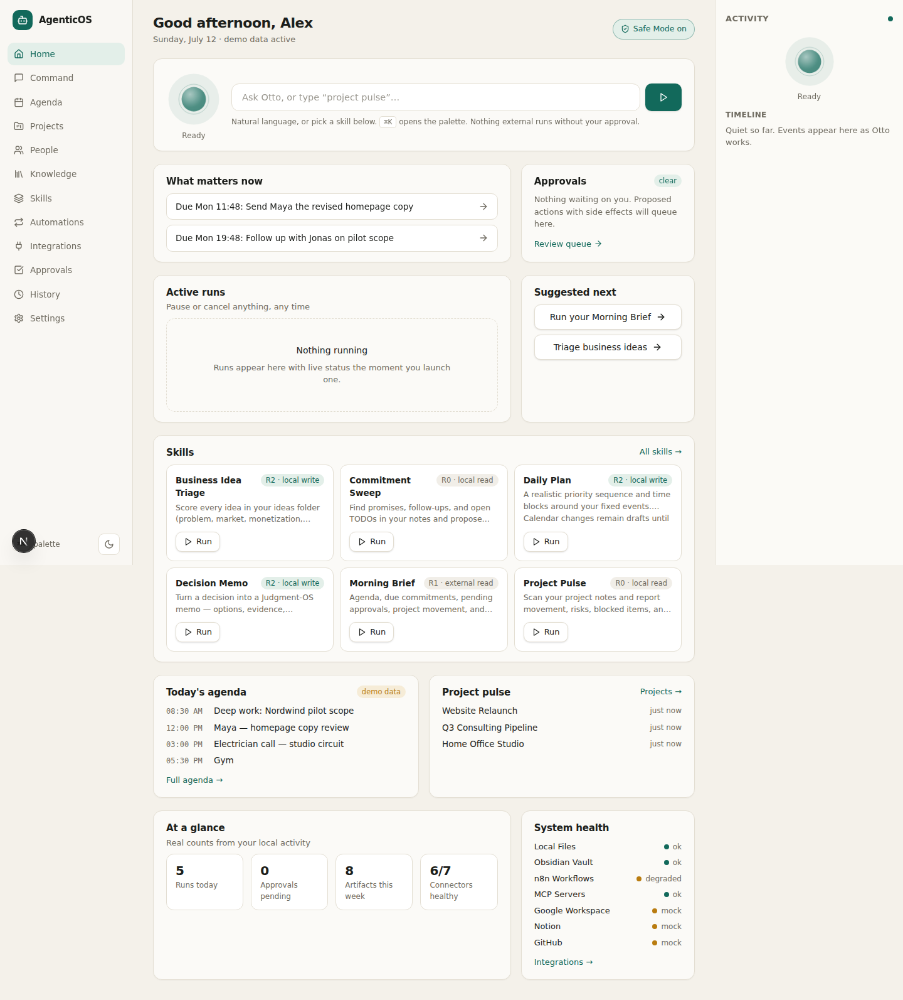

# AgenticOS Cockpit

A local-first, consumer-simple, professional-grade AI command center. The configurable primary
assistant persona is **Otto**. Claude is the initial reasoning runtime, but all state, policies,
skills, approvals, and audit history are provider-independent and live on your machine.

The cockpit answers four questions within five seconds of opening:

1. **What matters now?** — the briefing
2. **What should I do next?** — suggested actions and agenda
3. **What is Otto/Claude doing?** — the live activity rail
4. **What needs my approval?** — the approval queue

> Governing brief: [`BUILD_BRIEF.md`](BUILD_BRIEF.md) · Progress log: [`PROGRESS.md`](PROGRESS.md) ·
> Decisions: [`DECISIONS.md`](DECISIONS.md)

<p align="center">
  
</p>

*Home cockpit on demo data — desktop above; mobile and approval-queue captures in
[`docs/screenshots/`](docs/screenshots/).*

---

## Quick start

Prerequisites: **Node 20+ with pnpm 9+**, **Python 3.12+ with [uv](https://docs.astral.sh/uv/)**, `make`.
No Docker, Redis, Postgres, Qdrant, or Ollama required.

```bash
make setup     # install web + control-plane dependencies, run DB migrations
make demo      # seed demo workspace (safe: demo data only, no credentials needed)
make dev       # start control plane (http://localhost:8787) + web (http://localhost:3000)
```

Open http://localhost:3000. Onboarding runs on first launch; choose **“Use demo data”** to explore
everything without credentials. `make doctor` diagnoses missing prerequisites and configuration.

**One-click launcher (macOS):** [`desktop/Otto.app`](desktop/README.md) boots both servers and
opens the cockpit for you — drag it to your Desktop and double-click. `make app` rebuilds its icon.

Other commands:

```bash
make test      # all unit + integration tests (pytest + vitest)
make e2e       # Playwright end-to-end tests (starts both servers itself)
make lint      # ruff + eslint + tsc + mypy
make doctor    # environment / configuration diagnosis
```

If `uv` is unavailable, fallback commands are documented in [`docs/RUNBOOK.md`](docs/RUNBOOK.md).

## Connecting Claude (optional)

Demo mode works with no credentials using the deterministic mock runtime. To enable the real
Claude runtime:

1. Copy `.env.example` to `services/control-plane/.env`.
2. Set `ANTHROPIC_API_KEY` (or authenticate the `claude` CLI — the Agent SDK uses it).
3. Restart `make dev`; the Integrations screen shows the Claude provider as healthy.

Secrets are read from the environment through a `SecretStore` abstraction and are **never** stored
in SQLite, logs, or git.

## Architecture summary

```
User → Cockpit UI (Next.js) → Command API (FastAPI /api/v1)
     → Intent/Triage Router → one Skill → Plan
     → Policy + Approval Gateway (deterministic, R0–R4 risk model)
     → Agent Runtime (Claude SDK adapter | mock) → Typed Tool Gateway
     → Connector (local files, Obsidian, n8n, MCP, mocks) → Tool Result
     → Verification → Quality Review → Result + Artifacts + Audit events
```

- `apps/web` — Next.js 15 cockpit UI. Never imports provider or connector SDKs.
- `services/control-plane` — FastAPI + SQLAlchemy + SQLite (WAL + FTS5). Owns runs, events,
  policies, approvals, artifacts, memories, schedules. In-process worker executes runs.
- `packages/contracts` — OpenAPI schema + generated TypeScript client types.
- `skills/*` — versioned runtime skill definitions (manifest, schemas, prompts, fixtures).
- `connectors/*` — connector manifests and docs; implementations live in the control plane.
- `data/demo` — realistic, clearly-labeled demo vault, ideas folder, agenda, and people.

Details: [`docs/ARCHITECTURE.md`](docs/ARCHITECTURE.md) ·
[`docs/PRODUCT_SPEC.md`](docs/PRODUCT_SPEC.md) · [`docs/UX_SPEC.md`](docs/UX_SPEC.md) ·
[`docs/INTEGRATION_CONTRACTS.md`](docs/INTEGRATION_CONTRACTS.md)

## Security model (summary)

- **Claude reasons; deterministic code governs.** Permissions, risk, budgets, and approvals are
  code in the Policy Gateway, never prompts.
- **Risk ladder** R0 (local read) → R4 (destructive/financial/identity). R3+ always needs explicit
  approval; R4 is disabled or double-confirmed with a typed phrase.
- **Graduated autonomy** per skill/connector: Off → Observe → Recommend → Draft → Act with
  approval → Act within allowlist. New integrations default to Observe/Draft.
- **Safe Mode** blocks all external writes globally; the **kill switch** halts the worker.
- Retrieved content (files, emails, MCP output) is **data, not instructions** — it can never
  change policy, permissions, or approvals.
- Filesystem tools are restricted to configured roots; shell execution is not exposed as a
  runtime tool in the MVP.
- Logs are structured JSON with secret redaction.
- Honest limitation: this is process-level discipline on your own machine, **not** a hardened
  sandbox. See [`docs/THREAT_MODEL.md`](docs/THREAT_MODEL.md).

## Data locations, backup, export

| What | Where |
| --- | --- |
| SQLite database (runs, events, approvals, memories…) | `data/local/cockpit.db` |
| Artifacts (memos, reports, scorecards) | `data/local/artifacts/` |
| Demo content (safe to delete/regenerate) | `data/demo/` |
| Your Obsidian vault / ideas folder | wherever you point onboarding at (read-only by default) |

Backup = copy `data/local/`. Export: Settings → Storage → export, or
`GET /api/v1/memories/export` and `GET /api/v1/artifacts` (see RUNBOOK). Nothing leaves your
machine except calls to the model provider you explicitly configure.

## Troubleshooting

Run `make doctor` first — it checks runtimes, DB, migrations, configured paths, provider
credentials, and port conflicts, and prints a fix for each failure.
Common issues and recovery steps (port in use, missing uv, interrupted runs after a crash,
resetting demo data) are in [`docs/RUNBOOK.md`](docs/RUNBOOK.md).

## Repository layout

```
apps/web/                Next.js cockpit UI
services/control-plane/  FastAPI control plane (source of truth)
packages/contracts/      OpenAPI + generated TS types
skills/                  Runtime skill definitions (morning-brief, project-pulse, …)
connectors/              Connector manifests + docs
data/demo/               Demo vault, bizideas, agenda, people
data/local/              Your local state (gitignored)
docs/                    Product, UX, architecture, threat model, runbook, roadmap
.claude/skills/          Build-time Claude Code skills (not runtime skills)
```

Existing unrelated repo content (`copy_photos.sh`, `find_largest_files.sh`, `iran-news-timeline/`)
is preserved untouched.
